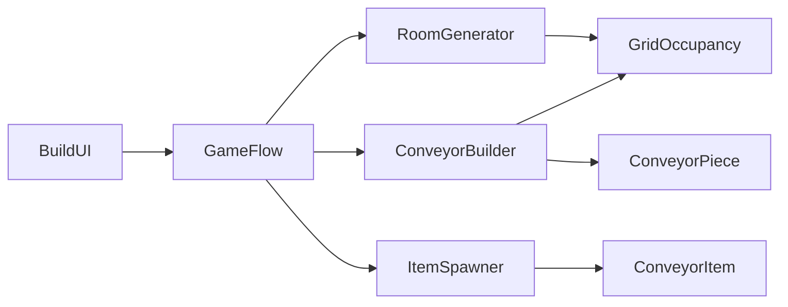
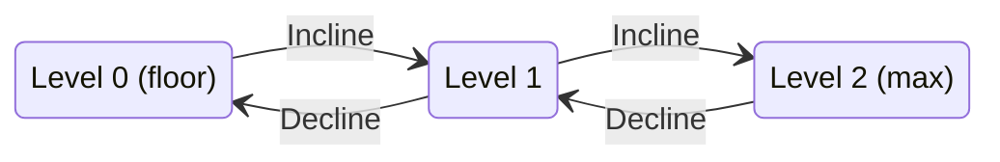

# Conveyor Belt Builder Prototype

A grid-based conveyor-building prototype made in Unity 6. The player builds a single chain of modular conveyor belts from a fixed start point to a fixed end point inside a randomly generated room, then presses **Begin** to send items along the chain.

The prototype is deliberately small, but its systems are data-driven and loosely coupled. New piece types, room sizes and item models can be added without touching code.

---

## Features

- **Three modular belt types:** Generic (3 cells), Short (2 cells, two-thirds of Generic), and Incline (2 cells long, climbs or descends one level).
- **Snap-to-chain placement:** a ghost preview follows the mouse and snaps onto the open end of the chain when within 2.5 cells. It is tinted green when placement is legal and red when it is not.
- **90° rotation** of the piece being placed with Q and E. Left and right turns are allowed; reversing into the chain is refused.
- **Incline / Decline toggle** with F. The status text reads "up" or "down" to match.
- **Height limits:** belts can never go below the floor (level 0) or above two incline stages (level 2).
- **One-way, unbroken chain:** every piece must start exactly where the previous one ends, so flow direction is guaranteed.
- **Undo** of the last piece with right-click or Backspace.
- **Procedural room:** a 20 × 20 × 20 cubic room with randomly placed obstacle cubes that never overlap the start, the end, or a clearance ring around them.
- **Guaranteed solvable layouts:** every generated layout is checked with a breadth-first search and regenerated if no ground-level route exists.
- **Run phase:** once the chain reaches the end point, Begin unlocks. Items spawn at the start, follow the chain (climbing, descending and turning corners), and are counted on delivery.
- **Scrolling belt textures** during the run phase (optional per prefab).
- **Reset** reloads the scene with a fresh obstacle layout.

---

## Controls

| Input | Action |
| --- | --- |
| `1` / `2` / `3` or UI buttons | Select Generic / Short / Incline |
| `Q` | Rotate the ghost 90° anticlockwise |
| `E` | Rotate the ghost 90° clockwise |
| `F` | Toggle the incline between Incline (up) and Decline (down) |
| Left mouse | Place the ghost when it is green |
| Right mouse / `Backspace` | Undo the last piece |
| `W` `A` `S` `D` | Pan the camera |
| Mouse wheel | Zoom the camera |
| **Begin** button | Start the run (enabled only when the chain is complete) |
| **Reset** button | Reload the scene with a new layout |

---

## Technologies

| Technology | Use in this project |
| --- | --- |
| **Unity 6 LTS** (6000.0 or newer) | Engine and editor |
| **C#** | All gameplay code (15 scripts) |
| **Universal Render Pipeline (URP)** | Rendering, Lit materials, transparent ghost materials |
| **Input System package** | Keyboard and mouse polling via `Keyboard.current` / `Mouse.current` |
| **uGUI + TextMeshPro** | Piece buttons, Begin/Reset buttons, status and controls text |
| **ScriptableObjects** | Data-driven conveyor piece definitions |
| **Unity Gizmos** | Edit-time alignment aids for prefabs and start/end points |

No third-party packages or assets are required.
FBX models provided by VACAC.
Conveyor belt texture licensed under CC0.

## Tools

- **Unity Hub and Unity Editor** for scene assembly, prefabs and Inspector configuration.
- **A C# IDE or code editor** for the scripts.
- **An external 3D modelling package** for the three conveyor models. The code is independent of how the models are authored, because each model is wrapped in a prefab and aligned against gizmos.
- **Unity primitives** (cubes, cylinders) for the room shell, obstacles, start/end pads and the open-end marker, so these need no custom art.

---

## Getting started

### Requirements

- Unity 6 LTS (6000.0 or newer) with the **Universal 3D** template
- **Active Input Handling** set to `Input System Package (New)` or `Both`

### Running the prototype

1. Open the project in Unity Hub.
2. Open `Assets//Scenes/Demo.unity`.
3. Make sure the scene is in **File → Build Profiles → Scene List**, which Reset needs.
4. Press Play.
5. Build a chain from the green start pad to the red end pad, then press **Begin**.

---

## Project structure

```
Assets/
    Definitions/   ConveyorDefinition assets (Generic, Short, Incline)
    Materials/     Floor, wall, obstacle, ghost (valid/invalid) and belt materials
    Models/        Source models for the three conveyor types
    Prefabs/       Conveyor, start, end, open-end marker and item prefabs
    Scenes/        Demo.unity
    Scripts/       All C# source
```

### Scene hierarchy

```
Demo (scene)
├── Main Camera
├── Directional Light
├── Global Volume
├── Level              GridOccupancy + RoomGenerator
├── StartPoint         GridPoint
├── EndPoint           GridPoint
├── OpenEndMarker
├── Systems            ConveyorBuilder + ItemSpawner + GameFlow
│   ├── Pieces         parent for placed belts
│   └── Items          parent for items
├── Canvas             BuildUI
└── EventSystem
```

---

## Architecture



`GameFlow` owns the build → run sequence. `GridOccupancy` is the single source of truth for which cells are taken, whether by obstacles, the start and end points, or placed belts.

### Script reference

| Layer | Script | Responsibility |
| --- | --- | --- |
| Grid | `GridDir.cs` | Four-way direction enum with rotate, opposite, vector and rotation helpers |
| Grid | `GridMath.cs` | Grid constants and cell ↔ world conversion |
| Grid | `GridOccupancy.cs` | Occupied-cell dictionary and room bounds |
| Pieces | `ConveyorDefinition.cs` | ScriptableObject describing one piece type |
| Pieces | `ConveyorPlacement.cs` | Pure-data struct: footprint, exit cell, model pose and path waypoints |
| Pieces | `ConveyorPiece.cs` | Prefab component: positions itself, scrolls the belt, draws alignment gizmos |
| Level | `GridPoint.cs` | Start and end markers |
| Level | `RoomGenerator.cs` | Room shell, obstacle placement and solvability check |
| Building | `ConveyorBuilder.cs` | Selection, ghost preview, input, validation, placing and undo |
| Run | `ConveyorPath.cs` | Distance-sampled polyline |
| Run | `ConveyorItem.cs` | Moves one item along the path |
| Run | `ItemSpawner.cs` | Spawns items on an interval and counts deliveries |
| Flow | `GameFlow.cs` | Generates the level, handles Begin and Reset |
| UI | `BuildUI.cs` | Buttons, status text and Begin/Reset wiring |
| UI | `CameraPan.cs` | Optional WASD pan and scroll zoom |

---

## How it works

### The grid

The world is divided into 1 × 1 unit cells and 1-unit height levels. Cell `(x, level, z)` has its centre at `(x + 0.5, level, z + 0.5)`. Directions are North (+Z), East (+X), South (−Z) and West (−X). A piece's flow direction is its local +Z. The belt surface sits 0.25 units above the base of its level.

### Placement and validation

The chain always has exactly one **open end**: the cell in front of the start point, or the exit cell of the last placed piece. Each frame, `ConveyorBuilder` builds a candidate `ConveyorPlacement` from the selected piece, the ghost's direction and the incline toggle, then checks it against these rules in order:

1. The ghost is snapped to the open end.
2. The piece does not reverse into the incoming flow.
3. Its output level is not below 0.
4. Its output level is not above 2.
5. Every cell it fills is inside the room.
6. Every cell it fills is free.
7. Its output cell is the end point, or is inside the room and free, which prevents dead ends.

The status text shows the first failing rule, or "Click to place."

### Height rules



Inclines fill both levels they span, so nothing can be built through a slope. A Decline reuses the Incline model, placed at its low end and turned to face backwards, reusing the provided incline model.

### Room generation

1. Build the floor, four walls and ceiling from primitives. Walls and ceiling don't cast shadows, so the interior stays lit.
2. Reserve the start cell, the cell in front of it and the end cell, each with a clearance ring.
3. Place obstacle cubes at random (edge 1–2 cells by default), skipping overlaps.
4. Run a breadth-first search over (cell, incoming direction) states, using only flat pieces and the builder's own rules, to prove a ground-level route exists. If none exists, discard the layout and retry, up to 25 times.

Size-1 obstacle cubes can be bridged at level 1 and size-2 cubes at level 2, which gives the incline pieces a real purpose.

### Run phase

When the last piece's exit cell equals the end cell, Begin unlocks. Pressing it:

1. Disables building.
2. Starts belt texture scrolling on every piece.
3. Builds one polyline: start centre → start edge → each piece's cell centres and exit edge → end centre.
4. Spawns items at a fixed interval that follow the polyline at constant speed, tilting on slopes and easing around corners.

Items follow a path rather than being pushed by physics. This keeps movement deterministic and avoids items slipping on inclines or jamming at corners.

---

## Modularity

The systems are designed so that common changes are **data changes, not code changes**.

### Adding a new conveyor type

1. Wrap the model in a prefab: an empty root with `ConveyorPiece`, and the model as a child named `Visual`, aligned to the gizmo.
2. Create a `ConveyorDefinition` asset (**Create → Conveyor → Conveyor Definition**) and set its display name, prefab, length in cells and whether it is an incline.
3. Add it to the `ConveyorBuilder` palette and add a matching UI button.

Footprint, exit cell, validation, occupancy, model placement and the item path are all derived from the definition's length and incline flag, so a 4-cell belt or a longer incline needs no new code.

### What is configurable in the Inspector

| Component | Settings |
| --- | --- |
| `GridOccupancy` | Room size (cells per side; the room stays cubic) |
| `RoomGenerator` | Obstacle count, cube size range, clearance radius, seed, retry count, wall thickness, materials, route-check piece lengths |
| `GridPoint` | Start and end cells, start facing |
| `ConveyorBuilder` | Palette, ghost materials, snap radius |
| `ConveyorPiece` | Belt renderer, material slot, scroll direction and speed |
| `ItemSpawner` | Item prefabs (any model; `ConveyorItem` is added automatically), spawn interval, item count, belt speed, item lift |
| `CameraPan` | Pan speed, zoom speed, height range |

### Separation of concerns

- **Pure data and maths** (`GridDir`, `GridMath`, `ConveyorPlacement`, `ConveyorPath`) have no scene dependencies and could be unit-tested in isolation.
- **Occupancy** is shared through one component, so obstacles, points and belts follow the same collision rules without knowing about each other.
- **Rules live in one place.** `ConveyorBuilder.Validate` holds the placement rules; the room generator's solvability check mirrors them.
- **The UI only reads state** and calls public methods (`SelectIndex`, `Begin`, `ResetLevel`). It can be replaced without touching gameplay code.
- **Item movement is independent of belt visuals.** Belt scrolling is cosmetic, so models can be swapped freely.

### Current limits to modularity

- Keys 1–3 are hard-coded to the first three palette entries; more piece types need extra bindings or UI-only selection.
- Grid dimensions in `GridMath` are compile-time constants, and models must match them.
- Inclines rise exactly one level; multi-level ramps would need `rise` values beyond ±1.
- The builder assumes a single chain with one open end.
- `GridOccupancy` is a simple singleton.
- Input uses direct device polling rather than Input Actions, so rebinding needs code changes.

---

## Known limitations

- Elevated flat belts float at levels 1 and 2, with no visual support structures.
- Items take a slight diagonal shortcut through corner cells.
- Only one start and one end point are supported.
- Begin button requires a complete chain; open chains cannot be run.
- The solvability check covers flat ground routes only. Inclines add extra routes on top but are not needed for a solution.
- There is no persistence: layouts and chains are lost on Reset.

---

## Possible future improvements

### Functionality

- **Branching:** splitters and mergers, by replacing the single open end with a set of open outputs.
- **More piece types:** curved corners, 90° turn pieces, longer ramps, bridges and tunnels.
- **Multiple sources and sinks** with item-type filtering and routing.
- **Objectives and scoring:** a piece budget, throughput targets, par times, or levels with fixed layouts.
- **Open-chain runs:** hand items to physics when the path runs out, so they fall off an unfinished chain.

### Building and editing

- **Free editing:** select and delete any piece, not just the last one, splitting the chain as needed.
- **Drag-to-build:** hold the mouse to lay a run of straight pieces in one gesture.
- **Support pillars** generated under elevated belts, stopping at the floor or an obstacle top.
- **Placement feedback:** highlight the blocking cell and show a direction arrow on the ghost.

### Systems and technical

- **Save and load** using `JsonUtility`: each piece's definition, origin, direction and rise are enough to rebuild the chain.
- **Input Actions asset** for rebindable controls and gamepad support.
- **Data-driven grid settings** by moving `GridMath` constants into a ScriptableObject.
- **Physics-based items** as an optional mode, using Rigidbodies pushed by belt surface velocity for collisions and spills.
- **Object pooling** for items, to avoid instantiate/destroy churn during long runs.
- **Unit tests** (Unity Test Framework) for `ConveyorPlacement`, `ConveyorPath` and the room solvability search.
- **Replace singletons** with explicit references or a lightweight service locator.

### Presentation

- Camera orbit, snap-to-open-end and top-down toggle.
- Sound effects for placing, undoing and delivering.
- Particle and animation feedback on delivery, with a throughput graph.
- Custom art for obstacles, the room and the start/end machines.
